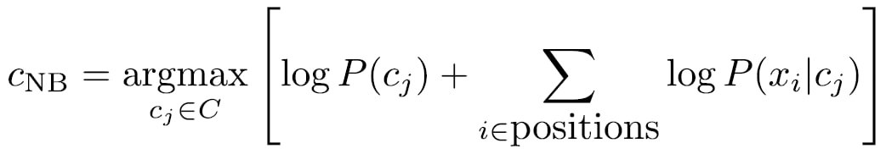

# TextClassifier
The problem to solve is attributing to a text given in input (only English language) a class among two: medical/non-medical.

## Dependencies
- [NLTK](https://www.nltk.org/)
- [Wikipedia-api](https://pypi.org/project/Wikipedia-API/)
- [Numpy](https://numpy.org)

## How to use
1. Use `./init.sh` to clear articles folder and retrieve category articles (it will take up to 5/6 minutes, on project download the data folder is already populated);
2. Use `./start.sh` to perform operations on articles and to perform the test.

## Project description
Articles are retrieved using the ***wikipedia API*** (via wikipediaapi module, that is a wrapper), the categories considered are:

- Medical categories: Pathology, Pediatrics, Neurology, Cardiology, Oncology;
- Non-medical categories: Politics, Ecology, Computer security, Electricity, Trigonometry.

the articles are divided in 80% train set and 20% test set.

After retrieving all articles, for each article execute some operations in order to have texts pre-processed:
1. perform ***tokenization***;
2. perform the ***stopwords*** elimination; 
3. perform either ***lemmatization*** or ***stemming*** using the Porter Stemmer algorithm.

After the pre-processing phase, we calculate the ***Bag of Words (BoW)*** for both medical articles and other categories articles.
Now we apply the ***Naive Bayes Rule*** in order to classify the test set.

The script will return some statistics about the test phase.